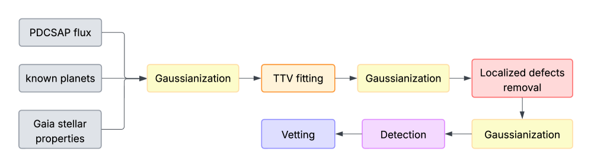
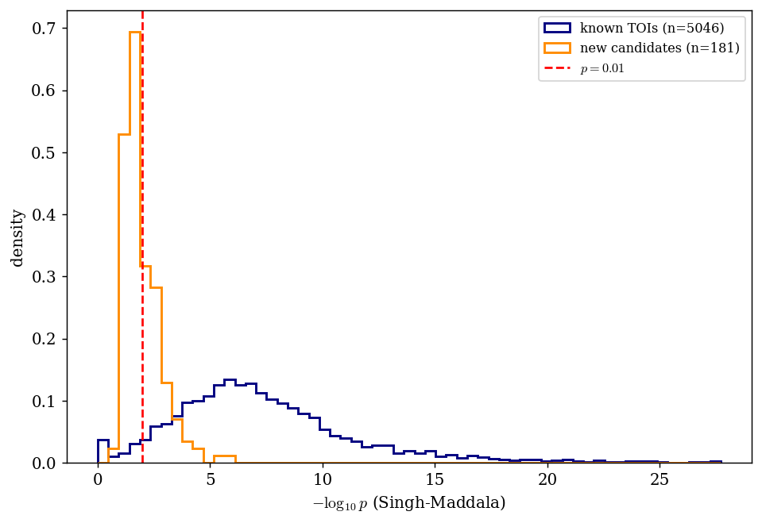
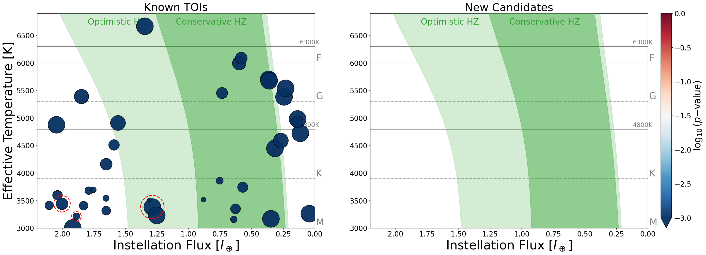
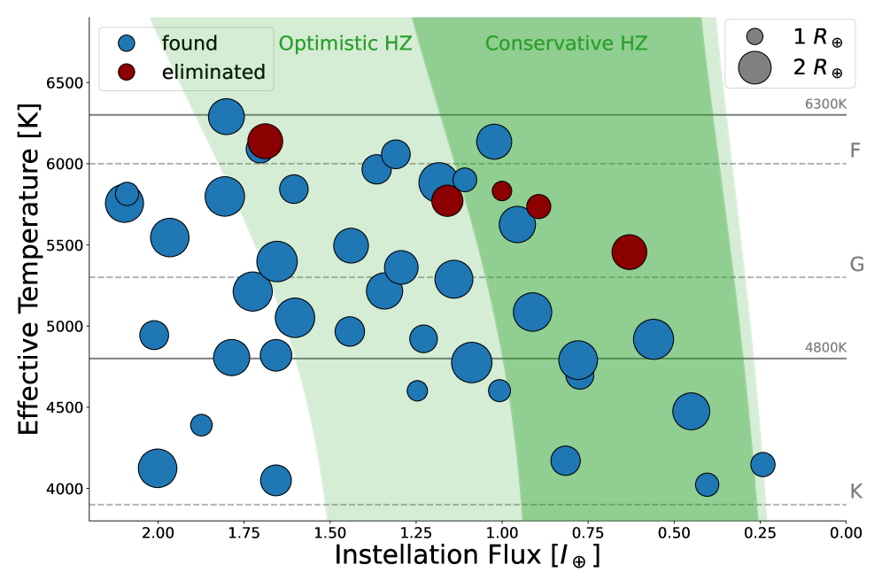

# Detection Pipeline Overview

This page summarises the automated pipeline behind this catalog. It searches TESS
(and Kepler) light curves for transiting exoplanets, rejects instrumental false
alarms, and assigns each candidate a statistically calibrated significance. The
full methodology is described in
[Robnik, Seljak, Jenkins & Bryson (2026)](https://arxiv.org/abs/2601.07465).

---

## Why is this hard?

An Earth-sized planet in a habitable-zone orbit blocks only about 100 ppm of its
star's light — 0.01 % — while the star itself typically varies by several times
that amount. Each transit lasts a few hours out of an orbital period of hundreds
of days, so even a multi-year baseline contains just a handful of events. And
almost any instrumental artefact — a thermal transient, a pixel sensitivity drop,
a cosmic-ray hit — can mimic a transit dip. A useful pipeline must therefore do
two things at once: detect real signals all the way down at the noise floor, and
reject the flood of false alarms it inevitably encounters there.

---

## Data model

We model the observed flux as the sum of three components,

$$
F(t) = F_\mathrm{GP}(t) + \epsilon(t) + \Delta(t),
$$

where $F_\mathrm{GP}$ is the stellar variability — a correlated Gaussian process —
$\epsilon$ is uncorrelated noise whose variance tracks the local flux level, and
$\Delta$ is the transit signal we are looking for.

The key simplification happens in Fourier space: there the stellar variability is
fully characterised by its power spectral density $P_k$. Once $P_k$ is known, the
data can be *whitened* — divided through by the noise spectrum — after which the
transit appears as a fixed template in approximately white noise, the textbook
setting for a matched filter.

We estimate $P_k$ directly from the data by smoothing the periodogram with an
adaptive window that widens toward high frequencies, allowing for mild
non-stationarity. Because stellar variability is broad and smooth in the spectral
domain while a transit is highly localised in time, this estimate is barely
perturbed by the presence of a planet.

---

## Pipeline overview

The pipeline runs in three sequential stages:

---

## Stage 1 — Preprocessing

Real light curves violate the Gaussian model in several distinct ways, and each
violation gets its own treatment before the search begins.

**Outlier Gaussianization.** Isolated outliers — saturation spikes, bright
pixels — would dominate a matched filter if left in place. We apply a monotonic
transformation that maps the empirical flux distribution onto a standard
Gaussian while leaving extended, correlated features (such as a transit dip)
intact. Estimating the power spectrum and applying the transformation are
alternated for two to three passes until both converge.

**Known-planet masking and TTV fitting.** Known large planets contaminate the
power-spectrum estimate and would suppress sensitivity to smaller companions.
Each known transit with SNR > 8 is refitted with a transit-timing-variation
(TTV) model to pin down its exact epoch; all known transits are then replaced by
the best-fit Gaussian-process prediction before the search continues.

**Localized defect removal.** Sudden pixel-sensitivity drops and thermal
transients leave step- and flare-like discontinuities. A template bank of
step-function and exponential-decay models is evaluated at every cadence; any
site matching with SNR > 8 is excised and filled with the GP interpolant. A
single uncorrected defect can otherwise seed many spurious harmonic peaks in the
period search.

**Harmonic / notch filtering.** Spacecraft electronics, reaction-wheel
harmonics, and stellar pulsation overtones produce narrow spikes in the power
spectrum. These are located by wavelet analysis and notch-filtered, suppressing
the matched-filter response at the affected frequencies.

---

## Stage 2 — Detection

For a transit of period $P$, epoch $\phi$, and duration $\tau$, the
matched-filter signal-to-noise ratio is

$$
\mathrm{SNR}(P,\phi,\tau) = \frac{\sum_k w_k \, \delta_k}{\sqrt{\sum_k w_k}},
$$

with $\delta_k$ the whitened flux at cadence $k$ and $w_k$ the matched-filter
weight, proportional to the transit template. The statistic we actually optimise
is the Bayes factor — the evidence ratio between the planet and no-planet
hypotheses, integrated over transit depth. For Gaussian noise its logarithm is
approximately $\frac{1}{2}\mathrm{SNR}^2$ minus a depth-prior penalty, so the
two views are nearly equivalent; the Bayes factor handles the look-elsewhere
correction more gracefully.

The Bayes factor is evaluated on a dense grid:

- **Period** — 0.2 to 40 days, sampled at ~150 000 trial periods, spaced so the
  phase drift accumulated over the full baseline never exceeds half a cadence.
- **Phase** — for each trial period, the optimal phase is found analytically in
  $O(N \log N)$ time via a Fourier-space inner product.
- **Duration** — Kepler's third law ties $\tau$ to the stellar density
  $\rho_\star$; only durations consistent with a physical orbit (within a ±15 %
  prior) are searched.

Local maxima above threshold ("threshold crossing peaks") are then reduced to
independent events by iterative masking: accept the strongest peak, subtract its
signal, re-search, and repeat until nothing exceeds the threshold.

---

## Stage 3 — Vetting

A search that reaches the noise floor necessarily turns up instrumental false
alarms. Three complementary tests reject them.

**Individual-transit glitch test.** Each transit event is compared against a
localized-defect hypothesis: does an instrumental-artefact model fit the dip
better than the transit template? Events where it does (empirical p-value < 0.1)
are flagged spurious. If flagged events carry more than 50 % of the total
$\mathrm{SNR}^2$, the candidate is rejected.

**Gap-proximity test.** TESS data gaps often coincide with thermal settling, so
transits within ~0.3 days of a gap edge are flagged as unreliable, with the same
50 % rejection rule.

**Per-transit SNR consistency.** A genuine planet spreads its significance
across transits in proportion to the data quality at each epoch. A χ² uniformity
test catches candidates whose signal is carried by one or two anomalously deep
events — the signature of an unmodeled systematic. Candidates with p-value
< 0.01 are rejected.

---

## Significance: null-simulation tests (NSTs)

The matched-filter SNR of pure noise depends on each star's variability in a
complicated way, so no universal SNR threshold is reliable. Instead we measure
each star's own noise floor empirically: ten independent searches are run per
star with slightly perturbed search grids (different random seeds), so that the
pipeline can only find noise peaks, never a coherent planet. The ten resulting
max-SNR values form the star's null distribution.

These null SNRs are **not Gaussian** — they have a heavy right tail, so a normal
model badly under-predicts how often noise alone reaches a high SNR and would
wildly over-state significance. Across ~5000 stars the null is instead very well
described by a **Singh-Maddala** (Burr Type XII) distribution, whose survival
function (the probability that noise exceeds a given SNR) is

$$
\mathrm{SF}(x \mid c,k,\lambda) = \big[\,1 + (x/\lambda)^{c}\,\big]^{-k}, \qquad c,k,\lambda > 0 .
$$

The survival-function panel (right) makes the point: in the tail the Gaussian
plunges far below the data, while the Singh-Maddala tracks it.

**Per-star Bayesian fit.** With only ten samples per star a free three-parameter
fit is noisy, so we fit $(c,k,\lambda)$ for each star by Hamiltonian Monte Carlo
with informative log-normal priors learned from the ~1000 stars for which we ran
100 NSTs:

$$
\frac{c}{27.9} \sim \mathrm{LogNormal}(0,0.47), \quad
\frac{k}{0.84} \sim \mathrm{LogNormal}(0,0.83), \quad
\frac{\lambda - 4.86}{1.82} \sim \mathrm{LogNormal}(0,0.91).
$$

A candidate's significance is then the **posterior-mean survival function** at its
SNR, marginalised over the fit's parameter uncertainty,

$$
p = \mathbb{E}_{\text{posterior}}\!\big[\,\mathrm{SF}(\mathrm{SNR}_\mathrm{cand} \mid c,k,\lambda)\,\big] .
$$

Marginalising — rather than plugging in a single best-fit $(c,k,\lambda)$ — is
essential: it fattens the tail to reflect that ten samples cannot fully pin down
the distribution, yielding a properly conservative p-value. (Click any row in the
catalog tables to see this survival function, the ten NST samples, and where the
candidate falls.)

**Does the prior help, and are ten NSTs enough?** On synthetic data we compare
three estimators of the true p-value: the Gaussian, an unregularised
(maximum-likelihood) Singh-Maddala, and the informed-prior Bayesian
Singh-Maddala. The Gaussian is biased at every sample size; the unregularised fit
is unbiased but noisy for few samples; the informed-prior fit is both unbiased and
stable from a handful of NSTs onward, so the ten used in production suffice:

**How significant are the candidates?** Comparing the $-\log_{10}(p)$
distributions of known TOIs and our new candidates (larger means more
significant):

The new candidates are systematically less significant than confirmed TOIs —
expected for a population living near the detection limit — but they sit clearly
above the per-star noise floor.

---

## Habitable zones

Each candidate's insolation relative to Earth follows from the stellar
parameters,

$$
\frac{S}{S_\oplus} = \left(\frac{R_\star}{R_\odot}\right)^{2}
\left(\frac{T_\mathrm{eff}}{5778\,\mathrm{K}}\right)^{4} a^{-2},
$$

with semi-major axis $a\,[\mathrm{AU}] = M_\star^{1/3}(P/365.25)^{2/3}$ and the
stellar mass $M_\star$ inferred from $R_\star$ and $\log g$. The habitable-zone
boundaries follow
[Kopparapu et al. (2014)](https://doi.org/10.1088/2041-8205/787/2/L29):
*runaway greenhouse* to *maximum greenhouse* for the conservative zone (dark
green) and *recent Venus* to *early Mars* for the optimistic zone (light green).

### TESS new candidates

Markers are coloured by $\log_{10}(p)$, clipped to $[-3, 0]$. A dashed red ring
marks candidates that fail at least one vetting test; gold stars mark candidates
inside the optimistic habitable zone.

Of the 195 new candidates, three land inside the optimistic habitable zone
(TIC 30853470, 52307802, 178709444) — all three also inside the conservative
zone — but each fails at least one vetting test, so none currently passes. For
comparison, 23 of the 5 245 known TOIs lie in the optimistic zone (17 pass all
tests) and 13 in the conservative zone (11 pass).

### Kepler candidates (Robnik et al. 2026)

The same pipeline applied to the Kepler dataset:

Several long-period habitable-zone candidates recovered by the pipeline (red
circles) are absent from previously published candidate lists (blue), having
been eliminated by earlier, less forgiving vetting. Conversely, the refined
vetting stage identifies KOI 8063.01, 8107.01, and 8242.01 as false alarms.
