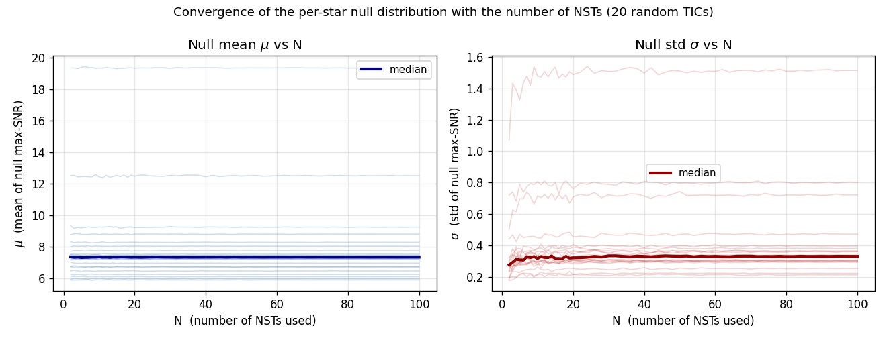
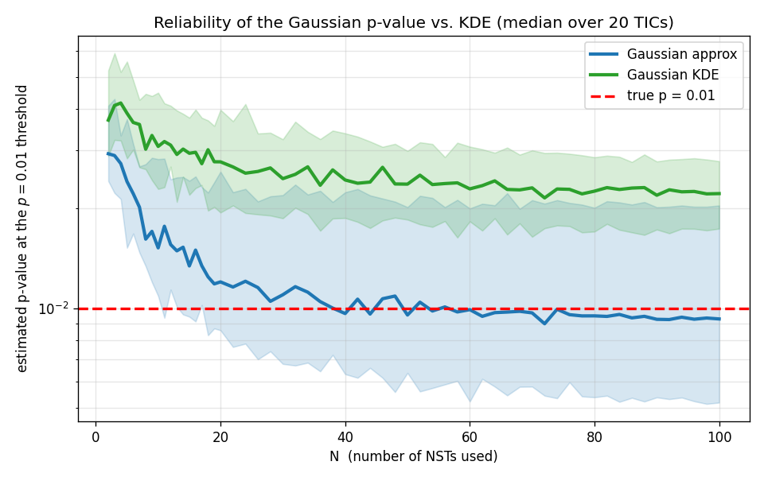

# Overview

We assign each candidate a significance by comparing its matched-filter SNR to a
per-star **null distribution**, built from null-simulation tests (NSTs). The
Gaussian p-value is

$$ p\text{-value} = 1 - \Phi\!\left(\frac{\mathrm{SNR} - \mu_\mathrm{null}}{\sigma_\mathrm{null}}\right), $$

where $\mu_\mathrm{null}$ and $\sigma_\mathrm{null}$ are the mean and standard
deviation of the maximum SNR recovered in each NST run on that star.

## How many NSTs are needed to estimate $\mu$ and $\sigma$?

Using ~100 NST runs for each of 20 randomly selected stars, we track the running
estimates of $\mu$ and $\sigma$ as a function of the number of NSTs used, $N$.

The mean $\mu$ stabilises almost immediately, while the standard deviation
$\sigma$ is noisy for $N \lesssim 20$ and settles by $N \approx 30$ — so a few
tens of NSTs suffice to pin down the null distribution.

## Is the Gaussian p-value reliable?

We pick, for each star, the SNR whose **true p-value is $0.01$** (the 99th
percentile of its null max-SNR samples) and estimate that p-value as a function
of $N$, both from the Gaussian approximation and from a Gaussian kernel-density
estimate (KDE) of the same samples.

The Gaussian approximation converges to the true $p = 0.01$ (red dashed) by
$N \approx 40$, whereas the KDE over-estimates the tail by roughly a factor of
two at these sample sizes (its kernels leak probability past the threshold).
The per-star null max-SNR distribution is therefore close to Gaussian, and the
Gaussian p-value is a reliable significance estimate.
