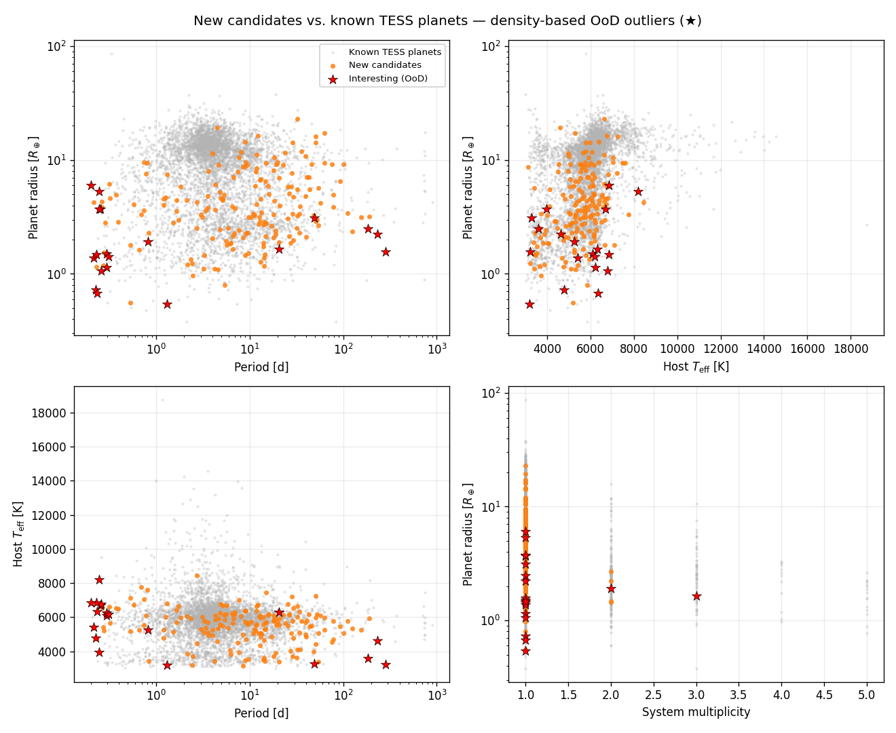

New planet candidates found by our pipeline that are **not** in the TESS Objects of Interest
(TOI) catalog.

## Outlier detection: the most interesting candidates

We summarise each candidate by four features — planet radius, orbital period,
host $T_\mathrm{eff}$, and system multiplicity — and estimate the density of the
**known** TESS planet population in that space with a Gaussian KDE. Candidates
that land in low-density regions are flagged as out-of-distribution (OoD)
outliers. The are the most interesting ones. The **Outlier score** column in the
table below ranks every candidate (higher = more unusual; flagged at an OoD
p-value $< 0.001$, $\approx 3\sigma$ — the most extreme 0.1% of the
known-population density). 19 candidates are flagged interesting.

Most of the outliers are ultra-short-period ($P \lesssim 0.3$ d) or long-period
($P \gtrsim 180$ d) planets, unusually large/small radii, or members of
multi-planet systems.